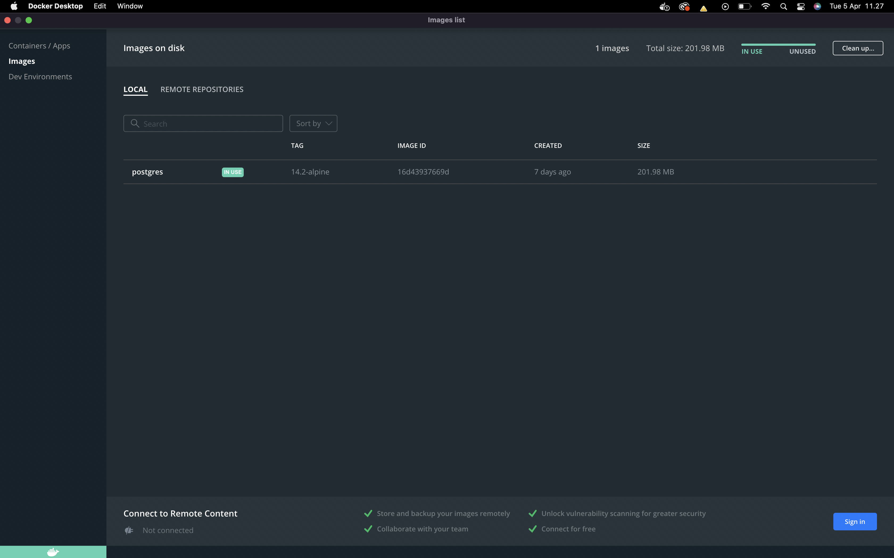
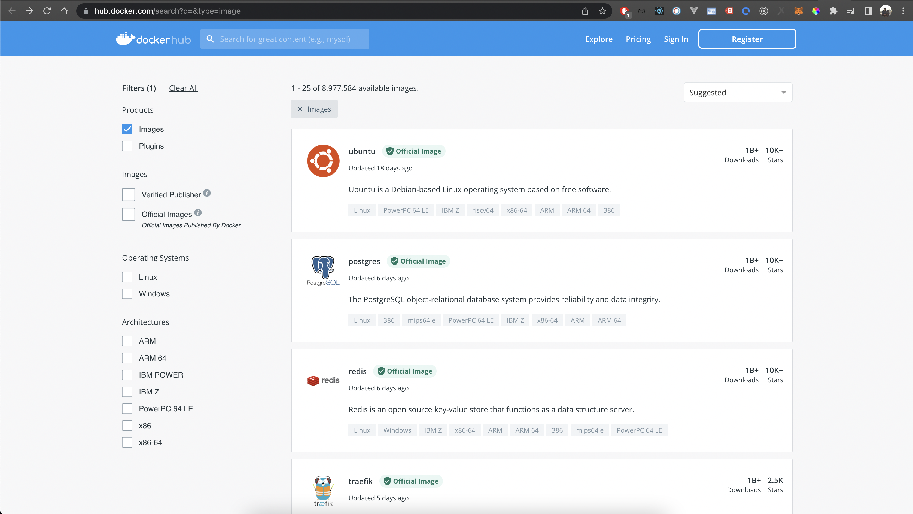

# Summay of Complete Intro Containers
- By: Hand
- Source: https://btholt.github.io/complete-intro-to-containers

## Crafting Containers By Hand
### What is Containers
a few features of the Linux kernel duct-taped together. Honestly, there's no single concept of a "container": it's just using a few features of Linux together to achieve isolation. That's it.

## Getting Set Up with Docker
Docker is a commandline tool that made creating, updating packaging, distributing, and running containers significantly easier which in turns allowed them become very popular with not just system administraters but the programming populace at large. At its heart, it's a command line to achieve what we were doing with cgroups, namespaces, and chroot but in a much more convenient way. Let's dive into the core concepts of Docker

### Docker Desktop


Go ahead and install Docker Desktop right now. It will work for both Mac and Windows. Docker Desktop runs the Docker daemon (daemon just means a program that runs in the background all the time) so that we can download, run, and build containers.

### Docker Hub


Docker Hub is a public registry of pre-made containers. Think of it like an npm for containers. Instead of having to handcraft everything yourself, you can start out with a base container from Docker Hub and start from there. 
https://hub.docker.com/search?q=&type=image

## Docker Images without Docker
### Images
These pre-made containers are called images. They basically dump out the state of the container, package that up, and store it so you can use it later. So let's go nab one of these image and run it! We're going to do it first without Docker to show you that you actually already knows what's going on.

First thing, let's go grab a container off of Docker Hub. Let's grab the latest Node.js container that runs Ubuntu.

### Docker Images without Docker
```
# start docker contanier with docker running in it connected to host docker daemon
docker run -ti -v /var/run/docker.sock:/var/run/docker.sock --privileged --rm --name docker-host docker:18.06.1-ce

# run stock alpine container
docker run --rm -dit --name my-alpine alpine:3.10 sh

# export running container's file system
docker export -o dockercontainer.tar my-alpine

# make container-root directory, export contents of container into it
mkdir container-root
tar xf dockercontainer.tar -C container-root/

# make a contained user, mount in name spaces
unshare --mount --uts --ipc --net --pid --fork --user --map-root-user chroot $PWD/container-root ash # this also does chroot for us
mount -t proc none /proc
mount -t sysfs none /sys
mount -t tmpfs none /tmp

# here's where you'd do all the cgroup rules making with the settings you wanted to
```

### Docker Images with Docker
So it's much easier to do what we did with Docker. Run this command:

```
docker run --interactive --tty alpine:3.10 # or, to be shorter: docker run -it alpine:3.10
```
This will drop you into a Alpine ash shell inside of a container as the root user of that container

So what if you wanted it to execute something? Try this:
```
docker run alpine:3.10 ls
```
More example: https://btholt.github.io/complete-intro-to-containers/docker-images-with-docker

### Node.js on Docker
The default Ubuntu container doesn't have Node.js installed. Let's use a different container
```
docker run -it node:12-stretch
```
Notice this drops us into the Node.js REPL which may or may not be what you want. What if we wanted to be dropped into bash of that container?
```
docker run -it node:12-stretch bash
```
More example: https://btholt.github.io/complete-intro-to-containers/nodejs-on-docker

### Tags
### Docker CLI
- pull / push
  pull allows you to pre-fetch container to run. P
  ```
  docker pull jturpin/hollywood
  docker run -it jturpin/hollywood hollywood # notice it's already loaded and cached here; it doesn't redownload it
  ```
That will pull the hollywood container from the user jturpin's user account. The second line will execute this fun container which is just meant to look a hacker's screen in a movie (it doesn't really do anything than look cool.)
- inspect
  ```
  docker inspect node
  ```
- pause / unpause <br>
  As it looks, these pauses or unpause all the processes in a container. Feel free to try
  ```
  docker run -dit jturpin/hollywood hollywood
  docker ps # see container running
  docker pause <ID or name>
  docker ps # see container paused
  docker unpause <ID or name>
  docker ps # see container running again
  docker kill <ID or name> # see container is gone
  ```
More example: https://btholt.github.io/complete-intro-to-containers/docker-cli
